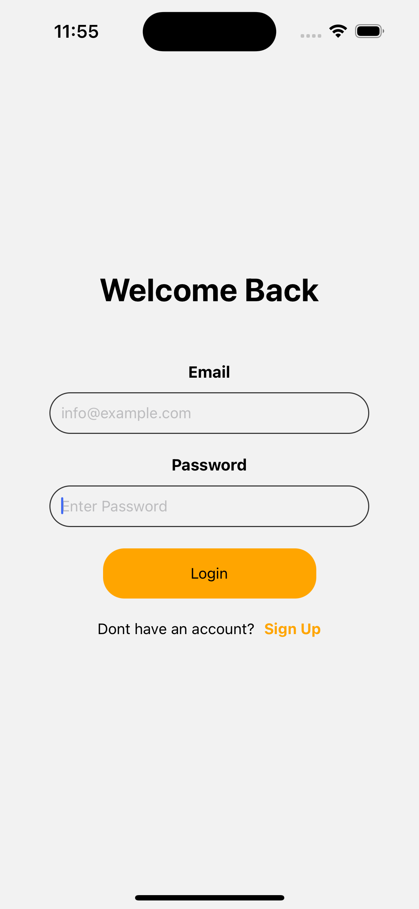
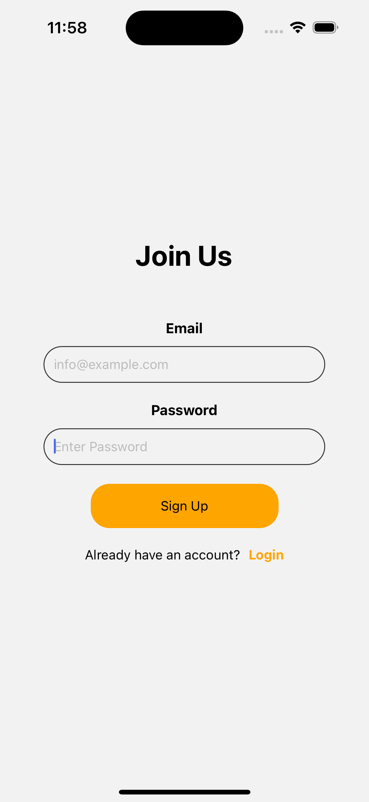
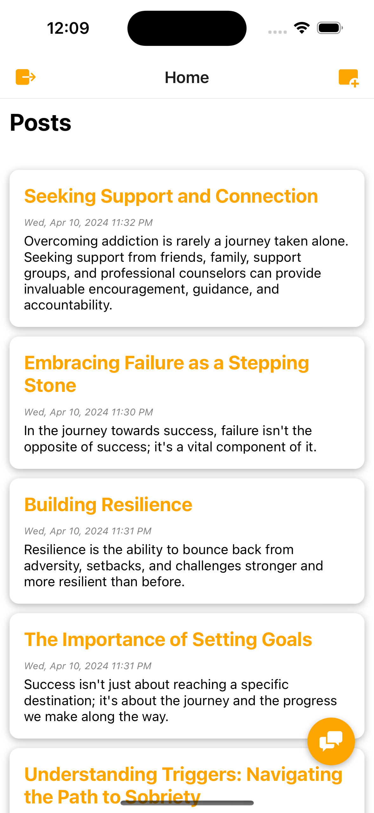
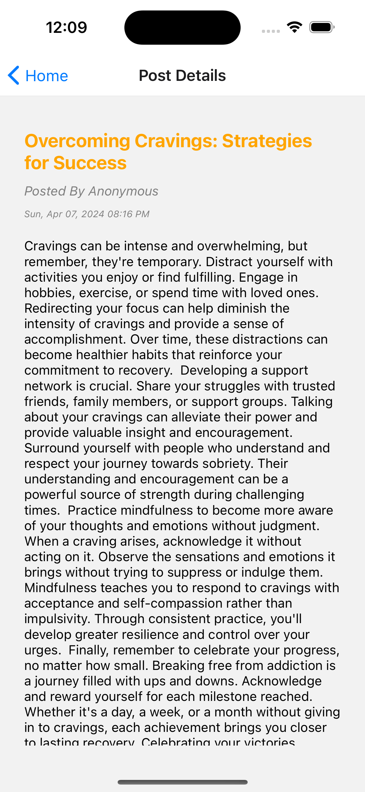
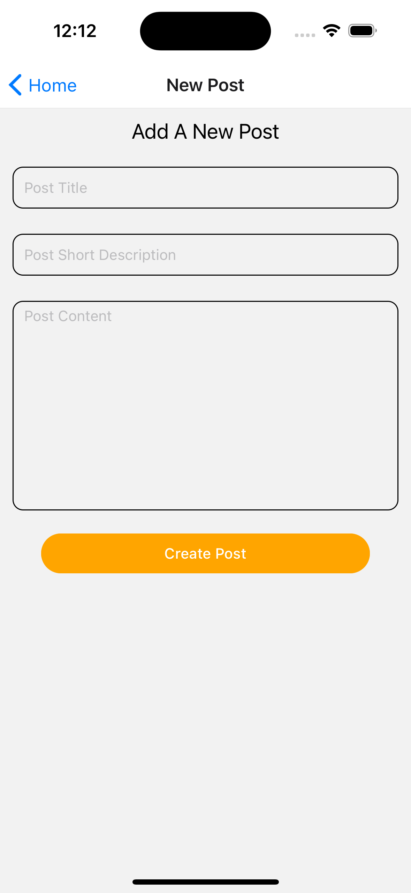
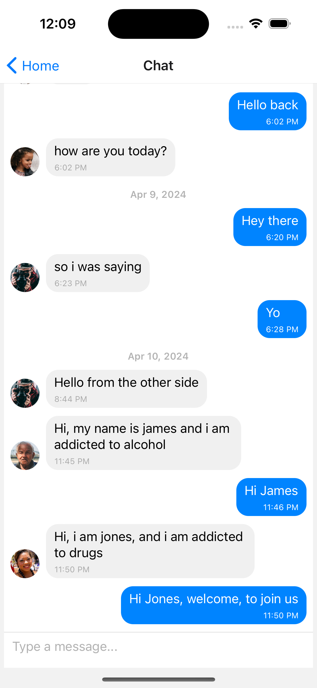
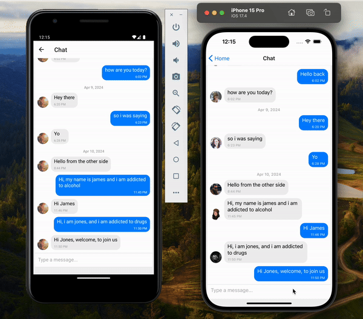

# CHATTEE

"Welcome to Chattee, your safe haven on the path to recovery. Designed for individuals navigating addiction, our platform provides a supportive community where users can share their journeys anonymously. Sign up today to contribute your own motivational posts, offering inspiration to others, while also finding encouragement in the words of fellow members. Engage in private chats with like-minded individuals, fostering connections that uplift and empower you on your quest for healing. Join us in this journey towards a brighter, healthier future, one step at a time."

"Chatee prioritizes anonymity and confidentiality, ensuring a judgment-free space for individuals grappling with addiction. With our user-friendly interface, accessing a wealth of motivational content and engaging with the community has never been easier. Whether you're seeking words of encouragement or offering your own support to others, Chattee is here to accompany you on your recovery journey. Join our compassionate community today and discover the strength in solidarity as we navigate towards a life of wellness and resilience together."

### Screenshots

#### Onboarding Screens

  
  
  
  

#### Auth Screens

  
  

#### User Screens

  
  
  
  

#### Realtime Chat Video

### Technologies Used

<a href="https://github.com/jfilter/react-native-onboarding-swiper#readme">React Native Onboard Swiper</a>

<a href="https://firebase.google.com/docs/auth">Firebase Authentication</a>

<a href="https://github.com/FaridSafi/react-native-gifted-chat?tab=readme-ov-file">Gifted Chat</a>

<a href="https://firebase.google.com/docs/firestore">Firebase Cloud Firestore</a>

